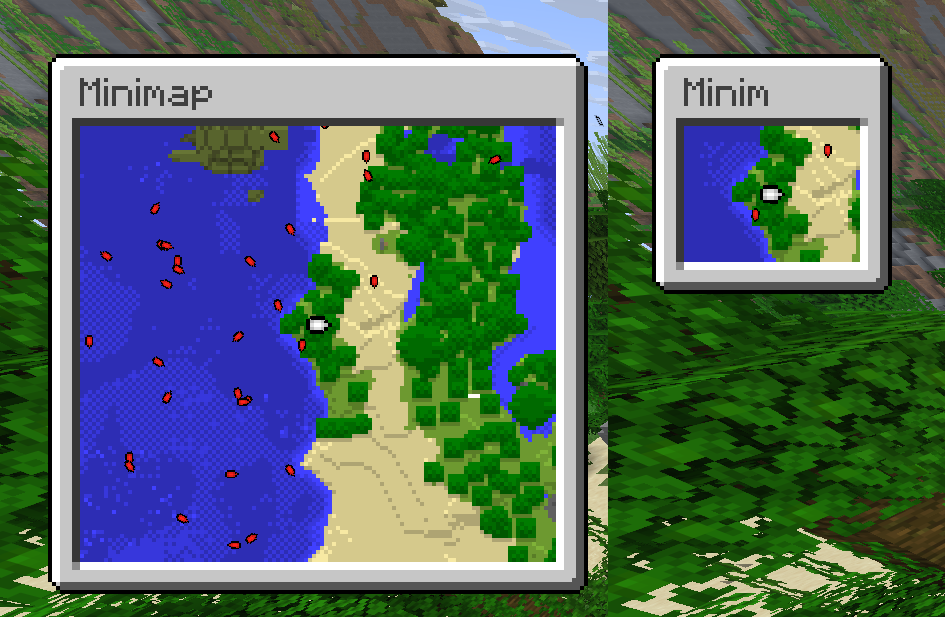
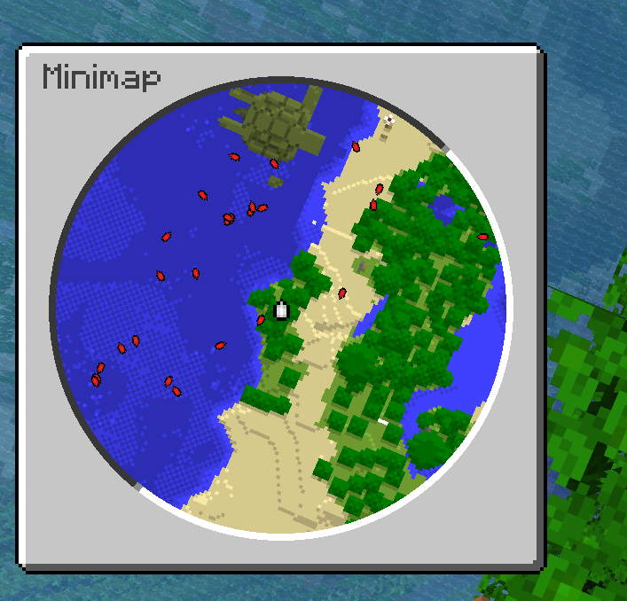

<div align="center">

# NMinimap

Serverside minimap based on core shaders


</div>

### Features

- Round and square minimap
- Unlimited amount of custom markers
- Side of the screen selection (left or right)
- Scale of map from 1x (1 pixel = 1 block) to 8x (1 pixel = 8x8 blocks)
- Map frames that can be switched in-game
- Async work as much as possible
- Map size up tp 127 x 127 pixels
- Automatic resource pack build
- Supported minecraft versions from 1.21.11 to 26.3
- Configurable mob and player radar
- Configurable water tint and opacity, globally or per underground layer
- WorldGuard underground layers with smart cave descent and optional connected-space filtering

### Supported server platforms
- [Papermc](https://papermc.io/software/paper/)
- [Folia](https://papermc.io/software/folia/)
- [Spigot](https://www.spigotmc.org/) with a [lot of limitations](#running-on-spigot)

### Showcase


### Dependencies

- [AnvilORM](https://github.com/NezuShin/AnvilORM/releases/) 1.0.2 or newer
- [Packet events](https://www.spigotmc.org/resources/packetevents-api.80279/)
- [PassengerAPI](https://www.spigotmc.org/resources/passengerapi-entity-passenger-bug-fixes-more.117017/) (Optional; Needed for compatibility with another plugins)
- [PlaceholderAPI](https://www.spigotmc.org/resources/placeholderapi.6245/) (Optional; If you need placeholders)
- [WorldGuard](https://enginehub.org/worldguard/) (Optional; Required for underground layers)

### Installation

- Install all [dependencies](#dependencies)
- Download jar from releases and put it to the server's plugins directory.
- Restart the server
- Install resource pack from `NMinimap/built-pack.zip`

Also, you can configure [PackMerger](https://www.spigotmc.org/resources/packmerger.132700/)
or [Resource Pack Manager](https://www.spigotmc.org/resources/resource-pack-manager.118574/) for automatic resource pack merge and distribution

### Water and underground rendering

Water rendering can be configured globally with `water-rendering` and overridden for each underground layer. `vanilla` keeps the original map shading; `fixed` applies a constant tint opacity; `depth` interpolates between minimum and maximum opacity according to water depth; `disabled` shows the block below the water. `color-source` selects whether the tint is blended with the water color or the block below it. All opacity and darkening values are between `0.0` and `1.0`.

The per-layer `water-rendering.scope` controls where its override applies. `region` (default) uses it only for pixels inside the layer's WorldGuard regions; outside pixels use the global water settings. `map` uses the layer's water settings across the whole minimap while the player is inside that layer, including surface pixels outside its regions. Outside pixels still use surface terrain and the layer's `darken` factor. The top-level `water-rendering` remains the default when no underground layer is active.

Underground layers require WorldGuard regions. With `no-opening-mode: descend`, each map column searches downward from `render-from-y` for `min-open-height` consecutive blocks listed in `transparent-blocks`. `min-y` can be a numeric Y coordinate or `region-floor`, which uses the minimum Y of the covering WorldGuard region; it must be at or below `render-from-y`. A column without a qualifying opening shows the darkened surface. `no-opening-mode: fixed` (the default) checks only `render-from-y` and retains the original slice there when no opening is found. There is no separate `enabled` switch.

An optional connectivity threshold excludes small isolated air or water pockets. `smart-descend-defaults.min-connected-columns` sets the default for all layers; a layer's `smart-descend.min-connected-columns` overrides it. `1` disables the connectivity check. Higher values require that many distinct horizontal columns in one six-directionally connected transparent space, searched within the current chunk and its eight neighbors. This is a local size check, not a pathfinding check from the player's position. Enabling it loads neighboring chunks during rendering and rerenders affected neighboring cached tiles after block changes.

```yaml
water-rendering:
  mode: depth
  min-opacity: 0.05
  max-opacity: 0.50
  depth-for-max-opacity: 12
  tint: "#3F9FD4"
  color-source: bottom

smart-descend-defaults:
  min-connected-columns: 1

underground-layers:
  flooded_cave:
    wg-regions: [my_flooded_cave]
    render-from-y: 50
    priority: 1
    darken: 0.5
    smart-descend:
      min-y: region-floor
      no-opening-mode: descend
      min-open-height: 2
      min-connected-columns: 8
      transparent-blocks: [AIR, CAVE_AIR, VOID_AIR, WATER]
    water-rendering:
      scope: map
      mode: fixed
      opacity: 0.15
      color-source: bottom
      underwater-darken: 0.10
```

Only blocks in `transparent-blocks` count as cave space; add `WATER` for flooded caves. Layer water settings not specified here inherit the global values. The tile cache is separated by rendering settings, so changes to these settings generate new tiles instead of reusing incompatible cached colors.

### Permissions

- `nminimap.admin` - access for `/minimap admin` command
- `nminimap.command.minimap` - access for player `/minimap` commands (if enabled in config)
- `nminimap.scale.1/2/4/8` - access for `/minimap scale` command (if enabled in config)
- `nminimap.frame.<frame-name>` - access for `/minimap frame <frame-name>` when that frame has `use-permission` enabled
- `nminimap.allow-radar` - access for `/minimap radar enable` command (if enabled in config)
- `nminimap.bedrock-bypass` - allow Bedrock players to use the minimap despite Bedrock restrictions
- Another minimap commands can be accessed without any permissions (unless `command-permission.use` is enabled)

### Admin commands
- `/minimap admin reload` - reload config
- `/minimap admin stats` - get statistics info
- `/minimap admin clean-cache` - clean cached tiles of map

### User commands

- `/minimap scale 1/2/4/8` - set map scale. 1 - one block per pixel, 2 - four blocks per pixel (2x2 zone), etc
- `/minimap side left/right` - set side of the screen where map will be displayed
- `/minimap style round/square` - set map round or square
- `/minimap disable/enable` - disable or enable map
- `/minimap radar disable/enable` - disable or enable mob radar
- `/minimap frame <name>/none` - set or remove minimap frame

### PlaceholderAPI Placeholders

#### Player related:
- `nminimap_enabled` - true or false
- `nminimap_is_bedrock` - true or false
- `nminimap_radar` - true or false
- `nminimap_scale` - 1, 2, 4, 8
- `nminimap_side` - right or left
- `nminimap_style` - round or square
- `nminimap_frame` - current map frame name; none if not set.

#### Statistics related:
- `nminimap_stats_loaded_tiles` - count of tiles in ram, number
- `nminimap_stats_cache_size` - total count of all cached chunks, number
- `nminimap_stats_enabled_maps` - how many players use map right now, number
- `nminimap_stats_bedrock_players` - how many Bedrock players are online, number
- `nminimap_stats_threads` - how many plugin's threads running right now, number
- `nminimap_stats_loading_chunks` - how many chunks are being rendered right now, number
- `nminimap_stats_render_queue` - how many chunks are waiting to be rendered, number
- `nminimap_stats_disk_total_space_g` - total available disk space in gigabytes, number (double)
- `nminimap_stats_disk_free_space_g` - free space on disk in gigabytes, number (double)
- `nminimap_stats_disk_total_space` - total available disk space in bytes, number
- `nminimap_stats_disk_free_space` - free space on disk in bytes, number
- `nminimap_stats_memory_used` - JVM heap memory used in bytes, number
- `nminimap_stats_memory_used_g` - JVM heap memory used in gigabytes, number (double)
- `nminimap_stats_memory_available` - JVM heap memory available until max (`-Xmx`) in bytes, number
- `nminimap_stats_memory_available_g` - JVM heap memory available until max (`-Xmx`) in gigabytes, number (double)
- `nminimap_stats_memory_nminimap` - estimated NMinimap tile memory usage in bytes, number
- `nminimap_stats_memory_nminimap_g` - estimated NMinimap tile memory usage in gigabytes, number (double)

### Markers

Markers are just font images with special marks on texture, so they have same limitations:
- No animations. But you can replace the icon to another one every AsyncMarkerRenderEvent call using API.
- Texture size is limited to 256 x 254 pixels (two extra columns used for marks)
- Note that large amount of big images can significantly slow down resource pack loading. 


To add marker, drop your image to `markers` directory and type `/minimap admin reload`. New resourcepack will be generated. \
You can make images smaller/bigger using `markers.sizes` config property. Like in `player_small` default marker. \
`keep-upright` (default true) keeps the icon screen-upright on a round map; set it to false to spin the icon with the map. This is baked into the resourcepack.

### Frames

Frames are borders drawn around the minimap. Players choose one with `/minimap frame <name>` (tab-complete lists available frames) or turn it off with `/minimap frame none`. New players get `default-settings.frame`. If a frame has `use-permission: true`, players need `nminimap.frame.<frame-name>`.

To add a frame, drop PNG files into the `frames` directory, reference them from the `frames` config section, and type `/minimap admin reload`. New resourcepack will be generated.

Each frame has two layer lists: `square` (used when the map is square) and `round` (used when the map is round). You can combine as many layers as you want. Layer `type` does not have to match map style — a round map may use a square overlay, and a square map may use a round ring.

```yaml
frames:
  default:
    square:
      layers:
        - texture: default_square
          type: square
          # z-index: 128   # omit to auto-assign 128, 129, ...
          offset:
            x: 0
            y: 0
    round:
      layers:
        - texture: default_round
          type: round
          inset: 0
```

`texture` is the file name in `NMinimap/frames/` without `.png`. Omitted `z-index` values are 128, 129, …; use under 128 to draw behind the map.

Layer types:
- `type: square` — flat texture above or below the map. Max size is 254×256, min height is 5. `offset.x` / `offset.y` shift it on screen (−127 to 127).
- `type: round` — horizontal strip the shader wraps into a ring. Strips are sliced into 256px-wide rows; packed height must stay ≤ 256 (min width is 4). A 1px-tall strip can be very long; a thicker strip must be shorter. `inset` pulls the ring inward over the map.

Both types also support `rotate-with-player`. `inverse-rotation` flips the yaw-follow direction and only applies when `rotate-with-player` is true. You can add or replace layers at render time using [`AsyncFrameRenderEvent`](#frames-1).

Both types can automatically downscale to fit `map-pixel-size`. Draw frames for size 127:



Layer type is independent of map style. This round map uses a round ring and a square title bar:



### Compatibility 

#### Core shaders and another plugins
Plugin uses `rendertype_text` shader, so shaders for hud or text decorations may not be compatible. In most plugins you must 
disable text decorations for NMinimap work.\
Patched shader examples for BetterHUD is already [provided](betterhud-patching.md). You can easily add compatibility using AI (or by hands if you are developer) via examples.

#### Minimap Mods

Plugin can turn off some mod-driven minimaps at all or while serverside minimap enabled:


Supported mods:
- [Xaero's Minimap](https://modrinth.com/mod/xaeros-minimap)
- [VoxelMap-Updated](https://modrinth.com/mod/voxelmap-updated)
- [JourneyMap](https://modrinth.com/mod/journeymap)
- Another mods do not have such functionality, or it is not documented. 

#### Iris/OptiFine shaders incompatibility

Compatibility cannot be added because Iris don't use core shaders. You can disable NMinimap for users with Iris using [NMinimapIrisBlocker](https://github.com/NezuShin/NMinimapIrisBlocker).  
Also, immediatelyfast mod support can't be supported by shader since 26.3.


#### Bedrock 

Bedrock is not supported yet due absolutely different render pipeline. Plugin will not allow bedrock players to turn on the minimap if [Geyser](https://modrinth.com/plugin/geyser) installed on server.\
Players with `nminimap.bedrock-bypass` can still use the commands.\
If you are Bedrock developer and want to contribute please [contact me](#help-and-support).


### How does it work?

#### Maps
Plugin spawns packet-based invisible item frames with a map in it and renders the map with special sequence on first row. 
Shader detects this row and places the map at corner of the screen. Vanilla maps still works (Except one map id used for display. Id is configurable).  
The first map column is also disabled for symmetry.

#### Markers

Marker images have for pixels with specific color on then's corners. For every combination of map style and screen corner image is being created. Four images in total \
Also color of image is used. Red is X position on map. Green is Y position on map. Blue is marker rotation.

#### Frames

Frames are font glyphs too. The plugin stamps metadata pixels onto each image (corners, size, offset, inset, rotate and inverse-rotate flags) and sends them as characters in the same text as markers. The shader recognizes those pixels and places the glyph on the minimap instead of drawing it as text. Square layers are positioned around the map; round layers are remapped from the strip into a ring in the fragment shader. The character color's red channel is z-index, so a layer can sit under the map (0–127) or over it (128–255) without editing the map pixels, and the blue channel rotates the layer on screen.

### API

Change player's map settings
```java
public void changeSettings(Player p) {
    var player = NMinimap.getInstance().getPlayersWithMap().stream().filter(i -> i.getPlayer().equals(p)).findFirst().orElse(null);

    player.setEnabled(true);
    player.setScale(8);
    player.getRight(true);
    player.setRound(true);
}
```

Draw on map and add markers. Both events being called on every map redraw. 

```java
@EventHandler
public void drawDot(AsyncMapRenderEvent event){
    byte[] mapData = event.getMapData();

    //middle of the map
    int x = 64;
    int y = 64;

    //Accepts only colors from ColorUtil.colors. Another values will result transparent color
    mapData[x + (y * 128)] = ColorUtil.exactColor(ColorUtil.colors[10]);


    int anotherX = 1;//first row is reserved for internal use. First **column** is disalbed for symmetry.  Displayed map has resolution 127 x 127
    int anotherY = 1;

    //Similar to deprecated MapPalette.matchColor(). Will find most nearest color.
    mapData[anotherX + (anotherY * 128)] = ColorUtil.getNearestColor(Color.fromRGB(255, 0, 0));
}

@EventHandler
public void drawMarker(AsyncMarkerRenderEvent e){
    List<NMapMarker> markers = e.getMarkers();

    String markerIcon = "player";//Icon from NMinimap/markers directory

    //Add marker with fixed location
    markers.add(new LocationMarker(markerIcon, new Location(e.getPlayer().getPlayer().getWorld(), 1, 1, 1)));

    int positionMarkerX = 0;//Accepts values from -127 to 127. -127 - left. 127 - right
    int positionMarkerY = 0;//-127 - top. 127 - bottom
    int positionMarkerRotation = 0;//from 0 to 256. 0 points top, 128 points bottom

    //Add marker with relative position on map.
    markers.add(new PositionMarker(markerIcon, positionMarkerX, positionMarkerY, positionMarkerRotation));

}
```

#### Frame-related api

Layer images are packed into the resourcepack on plugin load, so texture, type, offset, inset, `rotate-with-player` and `inverse-rotation` cannot change at render time. Z-index and rotation can.

Layers come from `FrameManager`, never from a constructor. `getLayers(texture)` returns every packed variant of one image in `NMinimap/frames/` — an image used by several frames with different offsets has one entry per variant.

Layers owned by the manager are shared between all players, so call `copy()` before changing one. The list in `AsyncFrameRenderEvent` is already a copy of the player's frame and is yours to modify.

```java
@EventHandler
public void drawFrame(AsyncFrameRenderEvent e) {
    List<FrameLayer> layers = e.getLayers();

    for (FrameLayer layer : layers)
        layer.setZIndex(200);//0-127 behind the map, 128-255 in front

    FrameManager frames = NMinimap.getInstance().getFrameManager();

    List<FrameLayer> variants = frames.getLayers("inventory_square");
    if (!variants.isEmpty()) {
        FrameLayer layer = variants.get(0).copy();
        layer.setRotation(64);//0-255 for a full turn, 0 points up
        layers.add(layer);
    }

    //Layers of another frame can be used too
    Frame frame = frames.getFrame("inventory");
    if (frame != null)
        for (FrameLayer layer : frame.layers(e.getPlayer().isRound()))
            layers.add(layer.copy());
}
```


### Inspirations
- [VanillaMinimaps](https://github.com/JNNGL/VanillaMinimaps)
- [Cartographer2](https://www.spigotmc.org/resources/cartographer-2-1-8-9-1-21-the-best-minimap-plugin-for-bukkit.46922/)
- [Minimap control](https://modrinth.com/plugin/minimap-control)


### Credits
- [NezuShin](https://github.com/NezuShin) - Plugin development
- [DartCat25](https://github.com/DartCat25) - Shader development
- [DEMEMZEA](https://github.com/DEMEMZEA) - Help with readme
- [Meisosi](https://github.com/meisosi) - Plugin development, `underground-layers` feature
- [RBLKtenarios](https://github.com/RBLKtenarios) - Greek translation


###  Looking for affordable and powerful Server hosting?

Make sure to check out [GaleniusNodes](https://dash.galeniusnodes.com/index.php?ref=nmap)! Starting at 3€/month.\
[With my link you can get 20% off Your first month](https://dash.galeniusnodes.com/index.php?ref=nmap)

### Help and support

If you have questions, want ask for a feature or report a bug - feel free to [open issue](https://github.com/NezuShin/NMinimap/issues),\
Also you can ask a question in the [discord server](https://discord.gg/rZ7gfCTr3Y).

### Running on spigot

Spigot is outdated server software and should not be used in production. However, it is possible to run NMinimap on Spigot.\
Main problem is that spigot, unlike paper, cannot load chunks asynchronously. To run on spigot, you need to set `max-render-threads` config property to `1`. Otherwise, the server will freeze on chunck generation.\
Also recommended to set `max-scale` to 1 or 2 to reduce server load.
